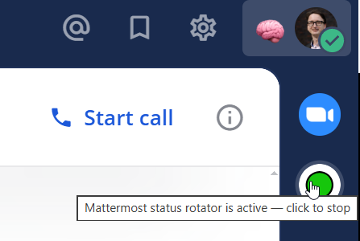

# Mattermost Status Rotator

A privacy-friendly Chrome extension that automatically rotates your Mattermost custom status from a local text file. It works with self-hosted Mattermost and Mattermost Cloud in Chromium-based browsers.

It integrates directly into the Mattermost app bar and lets you toggle the rotation on/off with a single click.

**Good for:** rotating availability messages, team announcements, focus modes, on-call notes, quotes, or playful status lines without a bot, server, or cloud service.



---

## ✨ Features

- 🔁 Automatically rotates your custom status every 5 minutes
- 📂 Reads statuses from a local `.txt` file
- 💾 Persists current position across reloads
- 🧠 Supports emoji (converted to Mattermost shortcodes)
- 🎛️ Toggle directly from the Mattermost app bar
- ⚫ Visual indicator (active / inactive)

---

## 📦 Installation (Developer Mode)

1. Clone this repository or use **Code → Download ZIP**:

   ```bash
   git clone https://github.com/thomasliebig/mattermost-status-rotator.git
   ```
2. Open Chrome and go to:
   `chrome://extensions/`
3. Enable **Developer mode** (top right)
4. Click **Load unpacked**
5. Select the folder:
   mattermost-status-rotator/

---

## 🚀 Usage

1. Open your Mattermost instance in the browser
2. Click the new icon in the **app bar**
3. Select a status file (or use the provided sample)
4. The rotator starts automatically

Click again to stop.

---

## 📝 Status File Format

Use one status per line.

### Recommended (Mattermost-compatible):
:brain: Thinking about ML theory  
:rocket: Shipping ideas  
:pretzel: German efficiency pending approval  

### Alternative (emoji-based):
🧠 Thinking about ML theory  
🚀 Shipping ideas  
🥨 German efficiency pending approval  

> Emojis are automatically mapped to Mattermost shortcodes when possible.

---

## 📁 Project Structure

.
├── mattermost-status-rotator/   # Chrome extension (load this)
├── mattermost-status.txt        # Example status file
├── images/
│   └── statusrotator.png               # UI screenshot
└── README.md

---

## ⚠️ Notes

- Requires Mattermost with custom status API enabled
- Works best in Chromium-based browsers (Chrome, Edge, Brave, etc.)
- File access requires user interaction (browser security restriction)

---

## 🔒 Privacy

- No data is sent anywhere
- All processing happens locally in your browser
- Status file is never uploaded

## How it differs from a Mattermost bot

Mattermost Status Rotator is a local browser extension, not a server plugin or chat bot. It needs no bot account, webhook, hosted scheduler, or external database. Use a bot or server integration instead when statuses must be centrally managed for multiple users or changed while the browser is closed.

---

## 💡 Ideas / Future Work

- Options page instead of file picker
- Cloud sync / shared status lists
- Smart/context-aware status updates
- Cross-browser support (Firefox)

---

## 🛠️ License

MIT

## Contributing

Bug reports and focused pull requests are welcome; see [CONTRIBUTING.md](CONTRIBUTING.md). If this extension is useful in your Mattermost workspace, consider starring the repository so other Mattermost users can find it.
